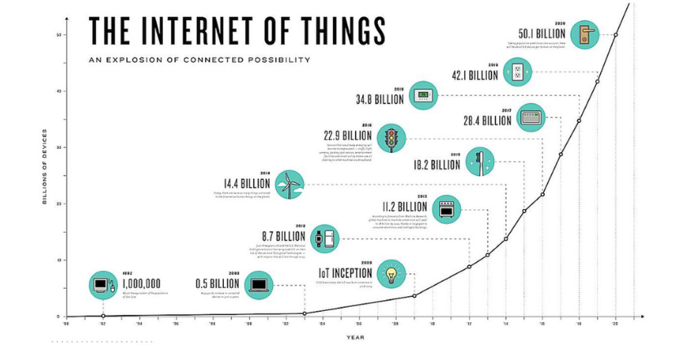
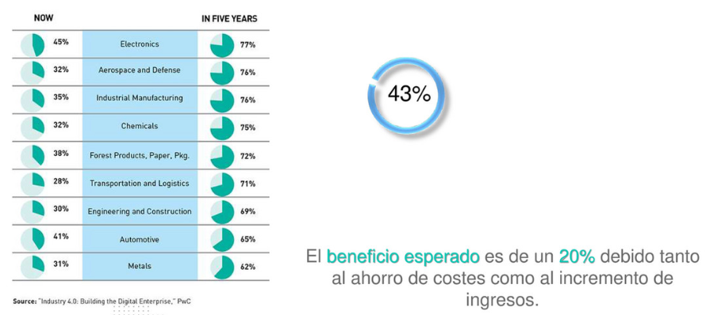
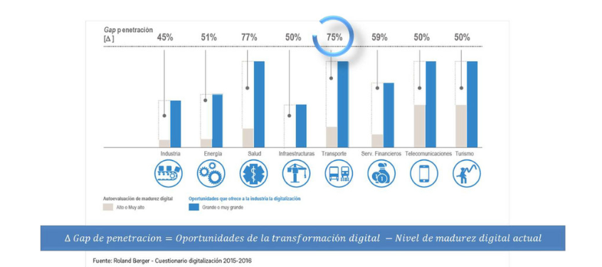
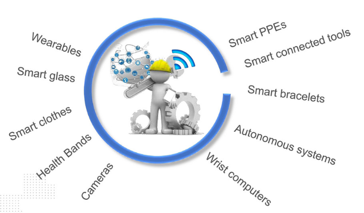

# IoT: Internet of the Things

### Objetivo

Toda revolución industrial ha supuesto un cambio basándose en determinadas máquinas desde la máquina de vapor hasta los ordenadores o móviles de hoy en día. La cuarta revolución industrial supondrá un cambio incluso en este concepto. Y es que, la máquina tractora de crecimiento industrial asociado a la generación de nuevos modelos económicos de crecimiento será todo aquel artilugio capaz de interconectarse e interactuar con el resto.

Por ello, mediante esta clase se pretende hacer ver a todo alumno el cambio que está previsto para el mundo laboral en los próximos años y cómo afectará al mismo. Por otro lado, se pretende familiarizar al alumno con este entorno aclarando conceptos técnicos.

| Contenido | Duración |
| ----- | ----- |
| **Clase** | 1 hora |
| **Práctica** | 30 minutos |

## 1.	Introducción: Mercado y operarios 4.0
### 1.1 El futuro industrial 4.0

El IoT ha sobrepasado todas las expectativas pasando de ser una esperanza a una realidad. A día de hoy, presenta un margen de integración del 43% a nivel mundial. Esto supondrá una reconfiguración económica global en los próximos años.

*Gráficas e imágenes que muestran el cambio:*

*Evolución del IoT:*

*Crecimiento por sectores:*

*Gap de penetración del IoT:*

### 1.2	Operarios 4.0

El operario 4.0 surge como evolución natural de la digitalización del entorno laboral. Como carácteristicas necesarias se podrían destacar una necesidad de incrementar su potencialidad, habilidades y capacidad de interactuar con el nuevo entorno de trabajo inteligente, digital y conectado.

*Links e imágenes de utilidad para el profesor:*

1. [El trabajador del futuro](https://www.negociosennavarra.com/trabajador-del-futuro-la-industria-4-0/): se muestra el perfil técnico al que tendrán que adaptarse los trabajadores en el futuro.

2. [Ejemplo práctico: Operario 4.0 Seat](https://www.europapress.es/motor/coches-00640/noticia-seat-presenta-concepto-operario-conectado-ii-congreso-industria-conectada-40-20180926191128.html): un ejemplo real.

3. [Vídeo adecuación del entorno de trabajo](https://www.youtube.com/watch?time_continue=50&v=mBNBELPMuXU): En este video se muestran unos de los cambios que se darán en los operarios.

4. *Imagen descriptiva:*

