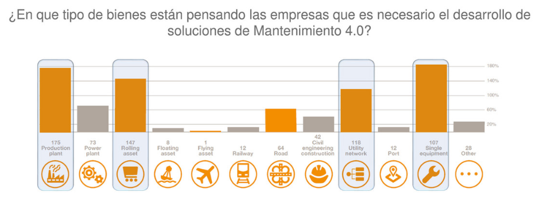
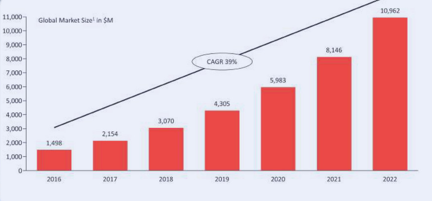
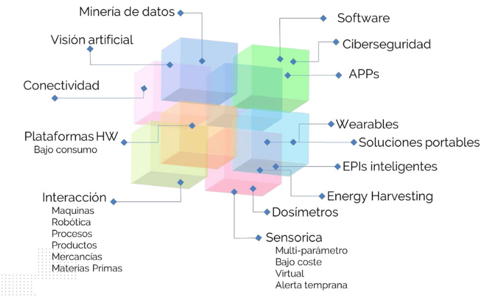

# IoT: Internet of the Things, *el internet de las cosas*

### Objetivo

Toda revolución industrial ha supuesto un cambio basándose en determinadas máquinas desde la máquina de vapor hasta los ordenadores o móviles de hoy en día. La cuarta revolución industrial supondrá un cambio incluso en este concepto. Y es que, la máquina tractora de crecimiento industrial asociado a la generación de nuevos modelos económicos de crecimiento será todo aquel artilugio capaz de interconectarse e interactuar con el resto.

Por ello, mediante esta clase se pretende hacer ver a todo alumno el cambio que está previsto para el mundo laboral en los próximos años y cómo afectará al mismo. Por otro lado, se pretende familiarizar al alumno con este entorno aclarando conceptos técnicos.

| Contenido | Duración |
| ----- | ----- |
| **Clase** | **1 hora** |
|  Introducción: Descripción del IoT | 15-20 minutos |
|  Futuro Industrial 4.0 | 10 minutos |
|  Operario Industrial 4.0 | 10 minutos |
|  Sectores e Impacto | 10 minutos |
|  Oportunidades | 10 minutos |
| **Práctica** | **30 minutos** |

## 1.Introducción al IoT:

-¿Qué es exactamente el IoT Internet de las Cosas? [link](https://www.domodesk.com/221-a-fondo-que-es-iot-el-internet-de-las-cosas.html)

-¿Qué nos ofrecerá?[link](https://www.domodesk.com/221-a-fondo-que-es-iot-el-internet-de-las-cosas.html)

-¿Cómo cambiará nuestra vida en el futuro? [Link](https://hipertextual.com/2015/06/internet-of-things)

-Ejemplos de aplicaciones de IoT:

[Link 1: 25 ejemplos de aplicación](https://soniadurolimia.com/25-ejemplos-internet-de-las-cosas-te-dejaran-la-boca-abierta/)

[Link 2: 10 ejemplos cotidianos](https://www.idat.edu.pe/blog/internet-de-las-cosas-10-ejemplos-innovadores)

## 2.Mercado y operarios 4.0
### 2.1 El futuro industrial 4.0

El IoT ha sobrepasado todas las expectativas pasando de ser una esperanza a una realidad. A día de hoy, presenta un margen de integración del 43% a nivel mundial. Esto supondrá una reconfiguración económica global en los próximos años.

*Gráficas e imágenes que muestran el cambio:*

*Evolución del IoT:*

*Crecimiento por sectores:*

*Gap de penetración del IoT:*

### 2.2	Operarios 4.0

El operario 4.0 surge como evolución natural de la digitalización del entorno laboral. Como carácteristicas necesarias se podrían destacar una necesidad de incrementar su potencialidad, habilidades y capacidad de interactuar con el nuevo entorno de trabajo inteligente, digital y conectado.

*Links e imágenes de utilidad para el profesor:*

1. [El trabajador del futuro](https://www.negociosennavarra.com/trabajador-del-futuro-la-industria-4-0/): se muestra el perfil técnico al que tendrán que adaptarse los trabajadores en el futuro.

2. [Ejemplo práctico: Operario 4.0 Seat](https://www.europapress.es/motor/coches-00640/noticia-seat-presenta-concepto-operario-conectado-ii-congreso-industria-conectada-40-20180926191128.html): un ejemplo real.

3. [Vídeo adecuación del entorno de trabajo](https://www.youtube.com/watch?time_continue=50&v=mBNBELPMuXU): En este video se muestran unos de los cambios que se darán en los operarios.

4. *Imagen descriptiva:*

## 3. Sectores e impacto:

La implementación de estas nuevas tecnologías supondrá una revolución del entorno laboral y abrirá paso a problemas irresolubles sin el uso de las nuevas herramientas inteligente. El ejemplo más claro a día de hoy es el mantenimiento predictivo que en múltiples casos tan solo es posible de realizarse gracias a la implementación de sensores inteligentes.

*Links e imágenes de utilidad para el profesor:*

1. *Desarrollo Mantenimiento predictivo:*

2. *Evolución Mantenimiento predictivo:*

3. [Informe Ministerio de Industria](https://www.mincotur.gob.es/Publicaciones/Publicacionesperiodicas/EconomiaIndustrial/RevistaEconomiaIndustrial/406/BLANCO,%20FONTRODONA%20Y%20POVEDA.pdf): Previsiones del estado español sobre el impacto de la cuarta revolucion industrial en determinados sectores. Páginas 155-156.

4. [Informe CCOO](http://www.industria.ccoo.es/4290fc51a3697f785ba14fce86528e10000060.pdf): Previsiones de Comisiones Obreras sobre el impacto de la cuarta revolucion industrial en el empleo español. Página 48.

## 4. Oportunidades:

La revolución del entorno industrial generará nuevas oportunidades de empleo y creara nuevas áreas de trabajo. Esto supondrá una oportunidad para todo aquel que se forme en las nuevas tecnologías. Esta imagen engloba unos de los nuevos campos en los cuales se crearán nuevas oportunidades:

